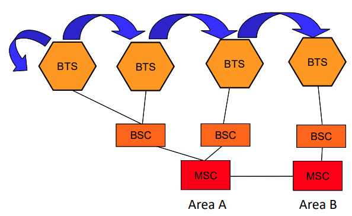
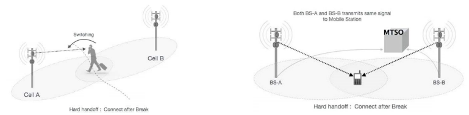
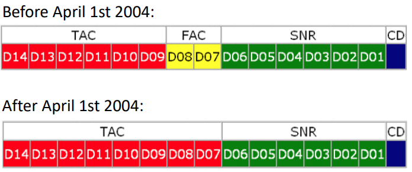
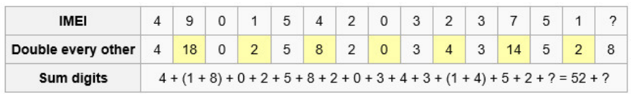
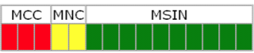

## How do cell phones work?  

Mode of communication:-  
• Full-Duplex  
– Operates on two channels  
– Speak and listen at the same time  
– Cell Phones – A cell phone is essentially a 2 way radio, consisting of a radio transmitter and a radio receiver. When chatting, phone converts voice into an electrical signal then transmitted via radio waves to the nearest cell tower  

• Half-Duplex  
– CB Radios (citizen band)  
• Radio frequency signal <-- > electrical signal  
– Only one party can speak at a time  
– Walkie-Talkie  

• Uses radio waves to talk to a cell tower that connects it to the rest of the phone network  

 

## Cellular Layout  

• A mobile phone network that is composed of “cell” or signal area. These cells join or overlap each other to form a large coverage area. Users on the network can cross into different cells without loosing connection.  

• Phone network allows for “Frequency Reuse”. Cell 1s is on the same frequency, but the different 1’s won’t interfere with each other because of physical separation. The interference is called “cross talk” where you can hear other people’s conversations.  

 

## Cellular Division  

A cellular device can communicate with another cellular device, land line, internet n others.  

Can you tell if there is anything special about the cell network diagram?  

Why the cells are all in Hexagon?  

Hexagonal shapes are preferred than square or circle in cellular architecture because it covers an entire area without overlapping!!  

 

How is data transmitted in mobile networks?  

## MTSO  

• Mobile Telephone Switching Office (MTSO)  
– Contains switching equipment for routing mobile phone calls  
– Handles the entire cell network  
– Controls handoff  
• Handoff – process of transferring an ongoing call or data session from one channel (cell) to another channel (cell)  
– Communicates with PSTN (Public Switch Telephone Network)  
• Land-line network  
– The BRAIN of the cell phone network!  

 

## Mobile Telephone Switching Office  

MTSO will evaluate the signal strength between the device and the network and tell the device or network to make the appropriate adjustments to the transmission.  

The MTSO is what causes transmission to occur between cellular to cellular, cellular to landline, cellular to internet.  

  

 

## How data is transmitted  

  

 

## What is a wireless frequency?  

• Transmission of voice or data through the use of electric waves that are set to specific frequencies.  
– No. of waves per second => frequency!!  
– Frequency is measured in Hertz or Hz  
– 1 Hz means 1 complete waves length per second  

   

## What happens when your phone turns on  

  

Phone must match service or phone goes into ROAM or No Service.  

 

## What happens when I place a call?  

  

 

## Cellular Hand Off  

  

BTS - Base Transceiver Station  
BSC - Base Station Controller  
MSC - Mobile Switching Centre  

If during a call, the signal on that channel from the tower servicing the call becomes weaker, then another tower and handoff is needed.  

If there is no other tower with a stronger signal, the call is dropped.  

 

## Difference between Hard and Soft Hand Off  

| S/No | Hard Hand-off | Soft Hand-off |
| -----  | ------------ | ------------ |
| 1 | The definition of a hard-hand off is one where an existing connection must be broken when the new one is established. Break then make. | Soft hand-off is defined as a hand-off where a new connection is established before old one is released. Make before break. |
| 2 | It allocates Different frequency | It allocates same frequency |
| 3 | Hard hand-off typically used in TDMA and FDMA | Soft hand-off used in CDMA and some TDMA systems | 
| 4 | Hard hand-off is not very complicated | More complex than hard hand-off |
| 5 | In hard hand-off handset always communicated with one BS at a time | Communicate up to three or four BS at the same time| 

  

 

## Cellular Subsets  

Access Technologies  

• How the phone talks to the tower:  
– AMPS (Advanced Mobile Phone System) FDMA, 800 MHz, 1G, Analog  
– TDMA (Time Division Multiple Access) 2G, Digital  
– iDEN (integrated Digital Enhanced Network) 2G, Digital  
– CDMA (Code Division Multiple Access) 2G/3G, Digital  
– GSM (Global System Mobile Communication) 2G, Digital  
– W-CDMA (Wideband CDMA) 3G, Digital  
– OFDM (Orthogonal frequency-division multiple access) 4G, Digital  

 

## TDMA  

• Time Division Multiple Access  

• A method of digitizing and compressing  
– A number of equal timeslots are configured for each frequency channel  

• Divides conversations by frequency and time  

• Outdated technology  

• It facilitates many users to share the same frequency without interference. Its technology divides a signal into different timeslots, and increases the data carrying capacity  

• Breaks up frequency allocation by time (i.e 6.7ms).  

• Two channels are used. (decoding/encoding)  

  

## iDEN  

• Integrated Digital Enhanced Network  

• Based on TDMA by Motorola  

• iDEN phones can support SMS messages, voice mail, and data networking such as VPNs, the Internet, and intranets.  

• Allows user to take advantage of PTT (push to talk) walkie talkie technology  
– Half duplex  
– Used by:  
• Sprint (shutdown in 2013)  
• AT&T  
• Verizon  

 

## CDMA  

• Code Division Multiple Access  

• Utilizes spread-spectrum technology  
– Spreads information contained in a particular signal (code) of interest over a much greater bandwidth than the original signal.  

• Assigns a code to each piece of data passed across the spectrum  

• Newer technologies still utilize the original TDMA concept. Deemed more superior to FDMA and TDMA  

• Unable to carry voice and data at the same time  

• Every communication channel uses the full available spectrum  

• Two channels • Encode / Decode  

• Spread Spectrum: channels are spread across the entire frequency range (1850- 1990MHz) instead of dedicated to one  

CDMA Family:-  

• cdmaOne (2G):  
– Original CDMA system  
• CDMA2000 (3G):  
– Evolved from cdmaOne  
– A family of technology for 3G mobile cellular communications for transmission of voice, data and signals  
– 1xRTT (Voice), 1xEV-DO (3G wireless standard-Data)  
• W-CDMA (3G):  
– Borrows ideas from CDMA  
– Use GSM technology and evolve into UMTS (Universal Mobile Telecommunications Service)  

 

## BitPIM Software for CDMA  

• BitPIM is an open source, crossplatform program that allows you to view and manipulate data on many CDMA phones.  
– These include the PhoneBook, Calendar, WallPapers, RingTones and the Filesystem.  

• Analyse most Qualcomm CDMA chipset based phones.  

• PIM stands for Personal Information Management  

 

## Qualcomm for CDMA  

• Founded in 1985 - Multinational semiconductor and telecommunications equipment company. Listed company in USA NASDAQ  

• Created CDMA and it’s components in the late 1990’s.  

• Commercially launched in 1995  

• Originally built base stations, chipsets, and cell phones.  

• Owns the patent on CDMA chipset technology  

 

## GSM  

• Based on TDMA  

• 70%-80% of the world’s phones  

• A digital cellular technology used for transmitting mobile voice and data services  

• Established 1987 as standard  
– Primarily developed in Europe  

• Available in over 212 countries and territories  

• Global Systems for Mobile Communication with frequency range from 850-1900MHz  

• Utilizes SIM technology  

 

## Cell Phone Identification Numbers  

MIN - Mobile Identity Number  

• 10 digit number  
– More with Country Code  

• Assigned by the carrier and used for mobile phone identification  

• It consists of two different parts MIN 1 and MIN 2  
– The MIN 1 is usually the 24-bit number after the area code  
– MIN 2 is the area/mobile subscriber code  

• Can be ported 

• e.g. (303)866-1010  

 

## ESN –Electronic Serial Number  

• Unique 32bit number assigned to each TDMA or CDMA (non GSM) device/equipment. (i.e Like MAC address in NIC)  

• As 8 bit manufacturer’s code almost exhausted, a 14 bit code authorized as a fill in until new system is in place.  

 

## MEID –Mobile Equipment ID  

• Replaces the soon to be exhausted ESN for CDMA devices.  

• All of these fields are hexadecimal values.  
– RR: Regional Code. Globally administered. 
– XXXXXX  
• 000000 - For small quantities of test/prototype mobiles.  
• 000001 - FFFFFE - Allocated to regional administration bodies or mobile manufacturers, subject to industry agreement.  
• FFFFFF – Reserved.  
– ZZZZZZ: Manufacturer assigned to uniquely ID device.  
– C – Check Digit: Not transmitted over the air.  

 

## IMEI – International Mobile Equipment Identity  

• The IMEI is a unique 15-digit code used to identify an individual GSM mobile telephone to a mobile network.  

  

• The IMEI can be displayed on most phones by dialing the code \*#06#.  

TAC: Type Approval Code - identifies the country in which type approval was sought for the phone, as well as the approval number. The post-2004 version changes the meaning of the acronym to Type Allocation Code.  

FAC : Final Assembly Code - identifies the company that produced the mobile phone  

SNR: Serial Number - uniquely assigned to the specific type of handset  

CD: Check Digit - used to check the IMEI for its validity  

 

## IMEI Checksum Verification  

The check digit is validated in three steps:  
1. Starting from the right, double every other digit (e.g., 7 → 14).  
2. Sum the digits (e.g., 14 → 1 + 4).  
3. Check if the sum is divisible by 10.  

### Example  

• Given IMEI is 49015420323751?  

  

• To make the sum divisible by 10, we set ? = 8,  

• So the IMEI is 490154203237518  

• Where are these???  

 

## IMSI -International Mobile Subscriber Identity  

• A global uniquely identifier. Always 56bit and is unique in every network.  

• Allowed for authentication of a device to a network  

• Consists of three parts:  
– MCC: mobile country code (3 digits)  
– MNC : mobile network code (2 digits)  
– MSIN: mobile station identification number (10 digits)  

  

