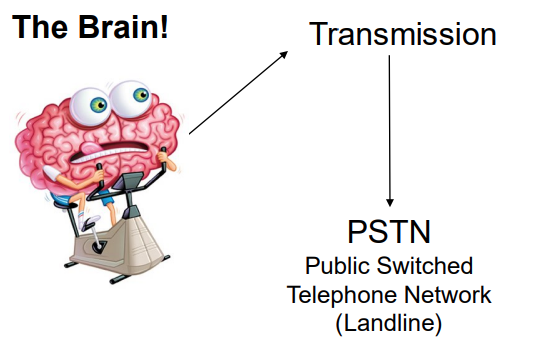
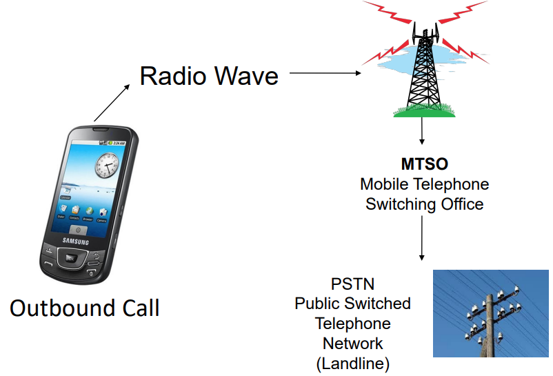
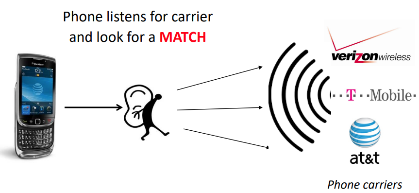
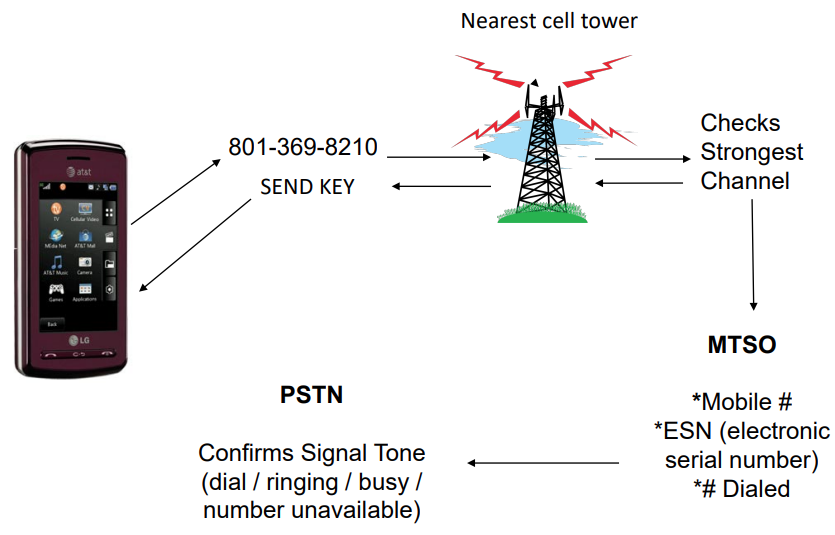

## How do cell phones work?  

Mode of communication:-  
• Full-Duplex  
– Operates on two channels  
– Speak and listen at the same time  
– Cell Phones – A cell phone is essentially a 2 way radio, consisting of a radio transmitter and a radio receiver. When chatting, phone converts voice into an electrical signal then transmitted via radio waves to the nearest cell tower  

• Half-Duplex  
– CB Radios (citizen band)  
• Radio frequency signal <-- > electrical signal  
– Only one party can speak at a time  
– Walkie-Talkie  

• Uses radio waves to talk to a cell tower that connects it to the rest of the phone network  

 

## Cellular Layout  

• A mobile phone network that is composed of “cell” or signal area. These cells join or overlap each other to form a large coverage area. Users on the network can cross into different cells without loosing connection.  

• Phone network allows for “Frequency Reuse”. Cell 1s is on the same frequency, but the different 1’s won’t interfere with each other because of physical separation. The interference is called “cross talk” where you can hear other people’s conversations.  

 

## Cellular Division  

A cellular device can communicate with another cellular device, land line, internet n others.  

Can you tell if there is anything special about the cell network diagram?  

Why the cells are all in Hexagon?  

Hexagonal shapes are preferred than square or circle in cellular architecture because it covers an entire area without overlapping!!  

 

How is data transmitted in mobile networks?  

## MTSO  

• Mobile Telephone Switching Office (MTSO)  
– Contains switching equipment for routing mobile phone calls  
– Handles the entire cell network  
– Controls handoff  
• Handoff – process of transferring an ongoing call or data session from one channel (cell) to another channel (cell)  
– Communicates with PSTN (Public Switch Telephone Network)  
• Land-line network  
– The BRAIN of the cell phone network!  

 

## Mobile Telephone Switching Office  

MTSO will evaluate the signal strength between the device and the network and tell the device or network to make the appropriate adjustments to the transmission.  

The MTSO is what causes transmission to occur between cellular to cellular, cellular to landline, cellular to internet.  

  

 

## How data is transmitted  

  

 

## What is a wireless frequency?  

• Transmission of voice or data through the use of electric waves that are set to specific frequencies.  
– No. of waves per second => frequency!!  
– Frequency is measured in Hertz or Hz  
– 1 Hz means 1 complete waves length per second  

   

## What happens when your phone turns on  

  

Phone must match service or phone goes into ROAM or No Service.  

 

## What happens when I place a call?  

  

